# 🛰️ SAMVID - Semantic Analysis and Multimodal Vision for Change Detection

Built for **Smart India Hackathon 2026** - Problem Statement **SIH26227: Semantic Retrieval and Multi-Temporal Change Analysis of Satellite Imagery** - by **Team NullNVoid**.

An analyst with years of satellite images over the same area doesn't really want to look at pictures. They want answers: *what changed here, when did it start, is it real or just the season, and where else is this happening?* SAMVID tries to answer those questions directly. You can search the archive in plain English, compare any two dates, get a ranked list of alerts with evidence, and see which areas are heating up. Everything runs **fully offline** on one machine, and every decision is written to a tamper-evident audit trail.

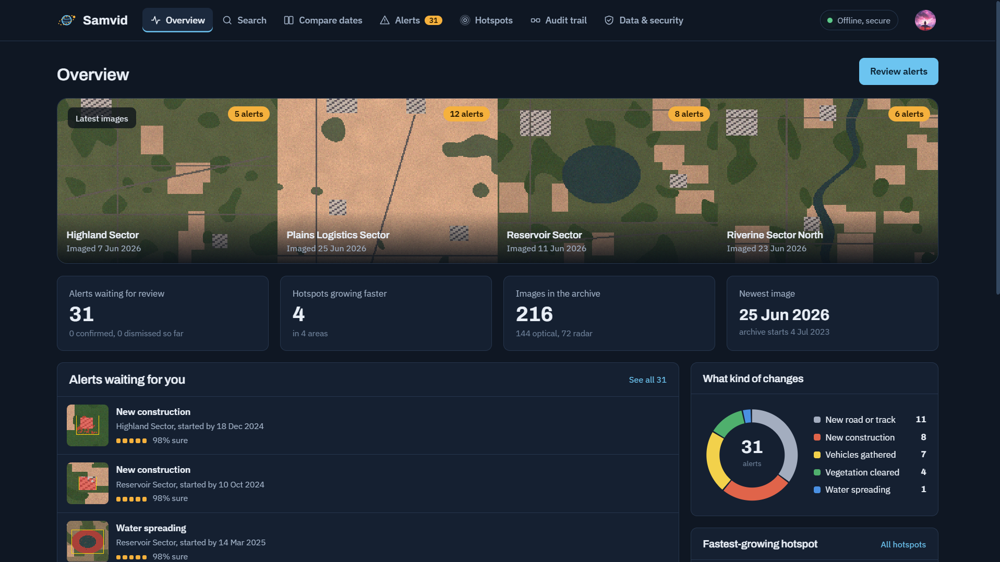

---

## The problem I was trying to solve

Most change-detection demos subtract two images and colour the difference. That falls apart quickly on real archives:

- **Seasons look like change.** Crops get harvested, rivers rise, snow comes and goes. A simple diff flags all of it.
- **Bad images poison the result.** Clouds, shadows, haze and a few pixels of misalignment show up as fake changes.
- **"When did it start?"** usually means opening every image one by one.
- **Searching an archive** needs coordinates and dates, not questions like *"new roads near the river"*.
- **Nobody can check the history.** Alerts get dismissed or edited with no record of who did what.
- **Sensitive imagery can't touch the cloud**, but most tools quietly call online maps, fonts or APIs.

SAMVID handles each of these: it learns every pixel's normal seasonal behaviour, cleans each image before using it, finds start dates with a binary search, supports semantic search, and keeps a hash-chained ledger. It also blocks any network traffic it doesn't need.

---

## What it does

### Overview
The Overview page shows:
- a strip with the latest clear image of each of the four monitored areas, with its alert count
- alerts waiting for review and the archive size
- a donut chart of change types
- the fastest-growing hotspot with its quarterly trend
- recent activity from the audit trail

Fonts and map rendering are bundled with the app, so nothing loads from the internet.


### Search the archive in plain English
Type something like *"new construction in the plains after 2025"* or *"places that lost vegetation near water"*. A local planner turns the question into concepts, areas and a date range. SAMVID then scores every tile in the archive, refines the results with a FAISS vector index, and explains in plain words why each result matched. If nothing fits well, it tells you so instead of returning random tiles. You can also search by uploading an image chip or clicking *"find similar"* on any result.

The planner is rule-based by default. If [Ollama](https://ollama.com) is running locally with `qwen2.5:7b-instruct`, it uses the LLM instead, and still makes no internet calls.

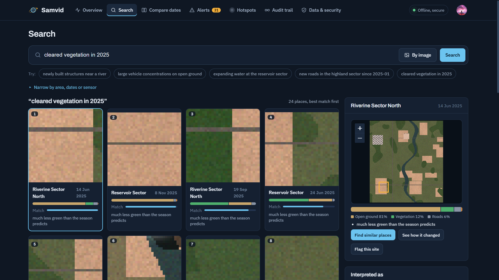

### Compare two dates
Pick an area and two dates. The date picker only offers dates that have an image, and shows how clear each image is. You get a before/after slider, a land-cover breakdown, and every change that **isn't explained by the season**. For each change SAMVID shows its type, direction (appeared, disappeared, grew, shrank), area and confidence, plus the earliest image where it is visible.

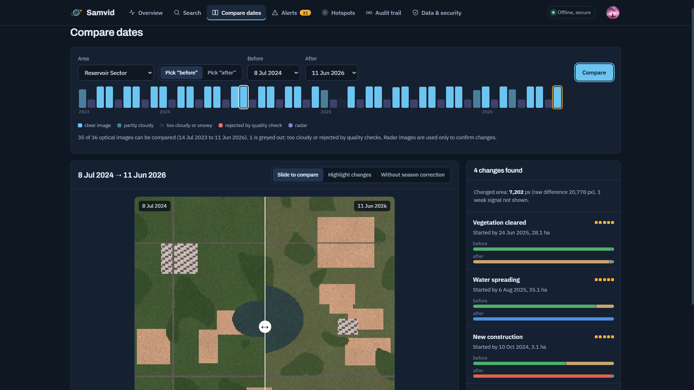

### Seasonal normalisation (the main idea)
SAMVID uses the first year of the archive to fit a robust harmonic model for every pixel, describing what normal looks like in each month. Later images are compared with this expected value, not with each other. A paddy field turning brown in November is normal. A field turning into concrete is not. On the reference set this cuts changed pixels from **579,566 to 50,846** and suppresses **343 seasonal false alarms**.

### Image quality pipeline
Before an image is used, SAMVID:
- masks cloud, snow and cloud shadow
- co-registers it to the reference using phase correlation, which recovers sub-tile shifts
- normalises its brightness against pseudo-invariant features
- flags haze

Images that are less than 70% clear are excluded from change decisions and labelled as such in the UI.

### Alerts and review
Detected changes are linked across quarters into tracks and ranked by confidence. Confidence combines change strength, area, image quality, registration accuracy, cluster stability and Sentinel-1 radar corroboration. Each alert has before/after/change images, a timeline showing when the change first appeared, and the reasons behind the score.

Analysts **confirm** or **dismiss** alerts. Each decision reranks the queue, so similar alerts move up or down.

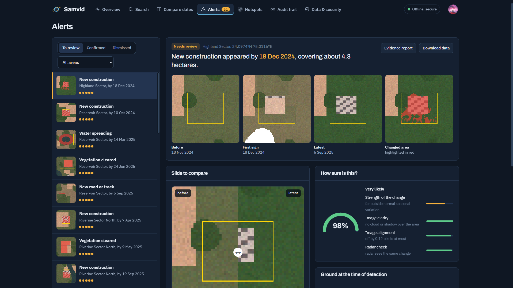

### PDF evidence reports
Any alert can be exported as a three-page PDF report, built on the server with ReportLab. No browser printing or internet connection is needed.

- **Page 1:** a summary of the change with a confidence gauge, the before / first sign / latest / changed-area images, land cover before and after, and a score bar for each reason the alert is trusted.
- **Page 2:** a seasonal chart showing the normal range for that spot against what was observed, a timeline of how the binary search found the first sign, the radar check, and the analyst's decision.
- **Page 3:** where the change sits in the full scene, the processing steps with their model versions, and the chain of custody. This shows whether the ledger was intact when the report was exported, plus every ledger entry for the alert.

Exporting a report is itself recorded in the ledger. Each alert also has a **Data (JSON)** export with the raw data.

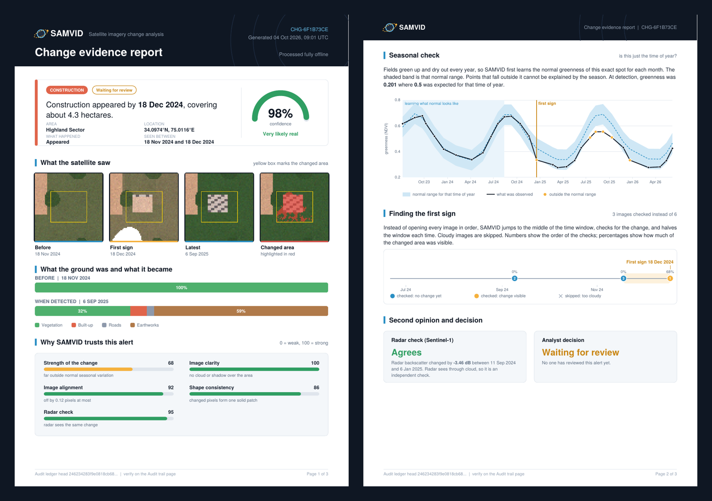

A sample report is in [`docs/sample-report.pdf`](docs/sample-report.pdf).

### Earliest-detection binary search
To find when a change began, SAMVID runs a binary search over the archive and skips cloudy images, instead of checking every image. On the reference set this takes **140 comparisons instead of 350**, and the start date is off by **1.19 months on average**.

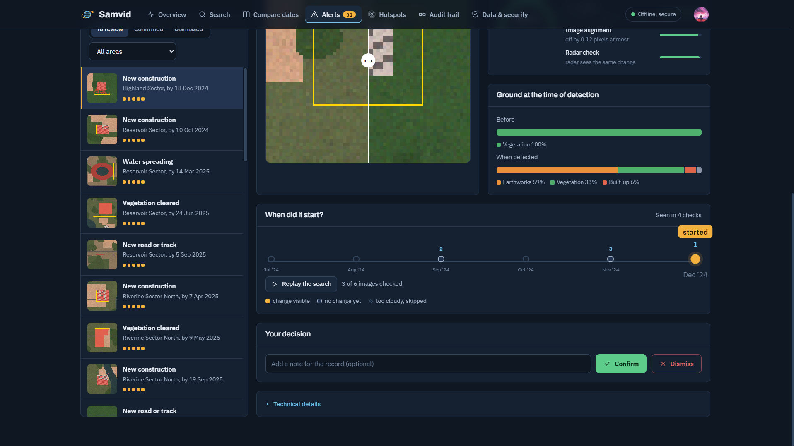

### Hotspots
Tiles with similar surface patterns are clustered with HDBSCAN. SAMVID then tracks how much ground in each cluster changes per quarter. A cluster becomes a **hotspot** if change keeps rising across several quarters, so one-off events and seasonal noise don't qualify.

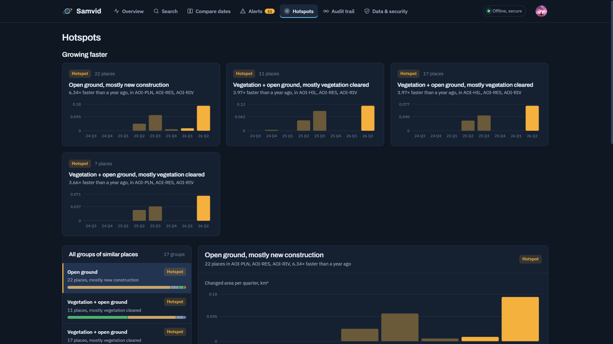
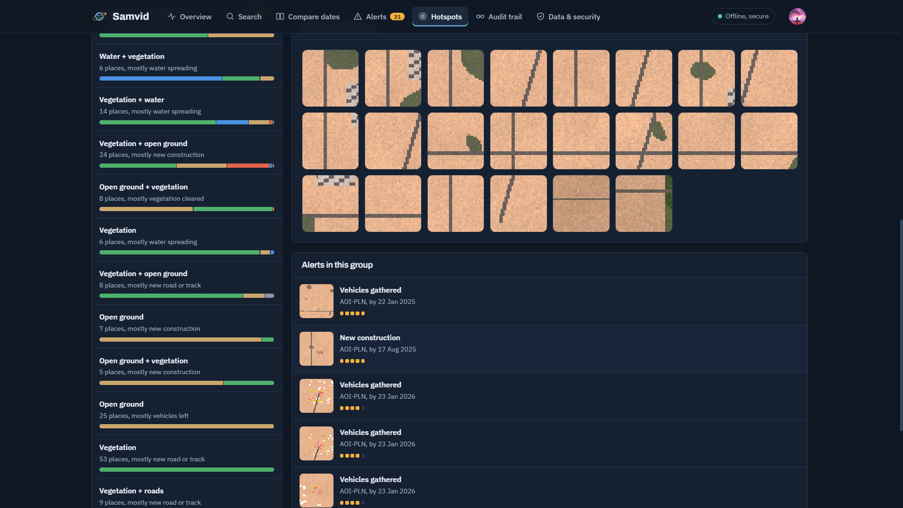

### Audit trail
Every ingest, analysis, review decision and report export is appended to a separate SHA-256 hash-chained ledger. Database triggers block edits and deletes. **Verify** recomputes the whole chain. **Tamper test** silently changes one entry and shows exactly where the chain breaks. The ledger can be exported for outside checking.

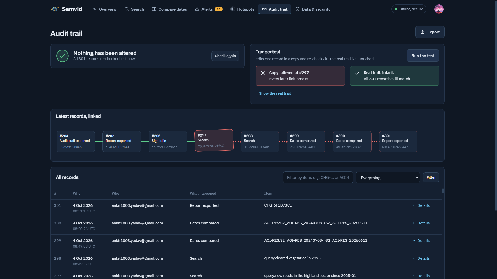

### Data & security
- **Offline guard:** a network guard blocks every connection that isn't to the local machine. A **Test it** button attempts an internet request and shows that it was blocked. If Google sign-in is enabled, the only allowed host is Firebase's certificate endpoint.
- **Load new images:** drop a GeoTIFF into the incoming folder and load it. It is quality-checked and added to the search index incrementally, and its area is re-analysed without a rebuild.
- **Validation:** results against the known-change reference set.
- **Components:** every library and model the app runs on, with its licence.

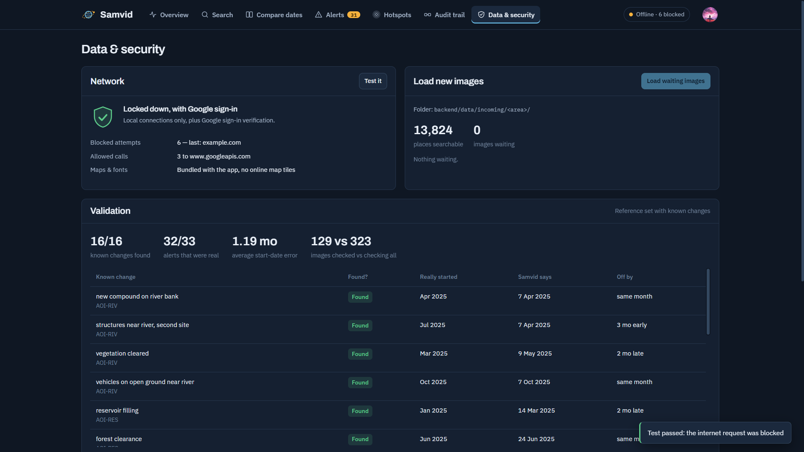

### Sign-in
SAMVID uses local accounts with PBKDF2-hashed passwords and two roles, analyst and supervisor. It also supports **Google sign-in through Firebase**, with the token verified server-side and an optional email/domain allow-list. If Firebase isn't configured, the Google button doesn't appear.

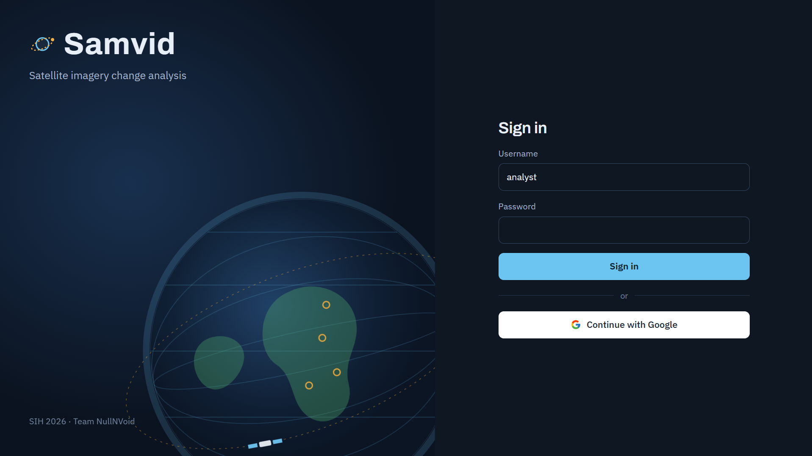

---

## Results on the reference set

The demo archive is synthetic Sentinel-2/Sentinel-1-like imagery with **16 planted changes** (construction, roads, clearing, flooding, water loss, vehicle gatherings and others) across 4 areas and 36 months. Because the true answer is known, every number below can be checked:

| Metric | Result |
|---|---|
| Known changes found | **16 / 16** (type correct for all 16) |
| Alerts that were real | **34 / 35** (precision 0.97) |
| Start-date error | **1.19 months** mean, 10/16 within one month |
| Images checked to find start date | **140** (binary) vs 350 (check all) |
| Changed pixels: naive diff → seasonal model | **579,566 → 50,846** |

Re-run with `python -m scripts.evaluate`. The results also appear on the Data & security page.

---

## 🏗️ Architecture

```text
┌──────────────────────────────────────────┐
│         Browser (Vite, vanilla JS)       │
│ Overview · Search · Compare · Alerts ·   │
│ Hotspots · Audit trail · Data & security │
│ Leaflet (no online tiles) · Firebase opt │
└────────────────────┬─────────────────────┘
                     │ /api  (bearer token)
                     ▼
┌──────────────────────────────────────────┐
│          FastAPI + uvicorn  :8000        │
│     ── offline guard: loopback only ──   │
├──────────────────────────────────────────┤
│ Ingest      rasterio COG → quality masks │
│             → co-registration → radio-   │
│             metric normalisation         │
│ Seasonal    per-pixel robust harmonics   │
│ Change      z-scores → HDBSCAN objects → │
│             type / direction / confidence│
│ Monitor     quarterly tracks + binary-   │
│             search earliest detection    │
│ Search      planner (rules / Ollama) →   │
│             concept scoring → FAISS      │
│ Discovery   tile clusters → hotspots     │
│ Review      confirm / dismiss → rerank   │
│ Reports     ReportLab PDF + JSON bundle  │
└───────┬───────────────┬──────────────┬───┘
        │               │              │
        ▼               ▼              ▼
┌──────────────┐ ┌─────────────┐ ┌──────────────┐
│ samvid.db    │ │ FAISS index │ │ ledger.db    │
│ SQLite       │ │ tile        │ │ SHA-256 hash │
│ catalogue    │ │ embeddings  │ │ chain, no    │
│              │ │             │ │ edit/delete  │
└──────────────┘ └─────────────┘ └──────────────┘
        ▲
        │ GeoTIFF / COG
┌──────────────────────────────────────────┐
│ data/archive/   data/incoming/<area>/    │
└──────────────────────────────────────────┘
```

---

## Tech stack

**Frontend**
- Vite (multi-page, vanilla JavaScript)
- Leaflet (local rendering, no online tiles)
- Firebase Web SDK (optional Google sign-in)
- Fontsource (bundled fonts: Archivo, IBM Plex Sans, IBM Plex Mono)
- Hand-built SVG charts and animations

**Backend**
- Python 3.12, FastAPI, uvicorn
- rasterio (GeoTIFF / COG)
- NumPy, SciPy (masks, co-registration, harmonic fitting)
- scikit-learn (HDBSCAN)
- FAISS (vector search)
- SQLite (catalogue + hash-chained ledger)
- ReportLab (PDF evidence reports)
- google-auth (Firebase token verification)
- Ollama + Qwen2.5 (optional local query planner)

**Deployment**
- Docker (multi-stage: Node build → Python runtime)
- Render (Blueprint in `render.yaml`)

---

## Getting it running

### 1. Clone it

```bash
git clone https://github.com/Ryzen-Starbit/samvid
cd samvid
```

### 2. Backend

```bash
cd backend
python -m venv .venv
```

Activate it:

```bash
# Windows
.venv\Scripts\activate
# Linux / macOS
source .venv/bin/activate
```

Install packages and build the demo archive. This generates the imagery, ingests it, builds the index and runs monitoring. It takes a few minutes the first time.

```bash
pip install -r requirements.txt
python -m scripts.setup_demo
```

Start the API:

```bash
uvicorn samvid.api:app --port 8000
```

### 3. Frontend

In a new terminal:

```bash
cd frontend
npm install
npm run dev
```

Open `http://localhost:5173`.

You can also run `npm run build` and open `http://localhost:8000`, because the backend serves the built frontend itself.

### 4. Environment files (optional - only for Google sign-in)

Copy the templates. **Never commit the real `.env` files.**

`backend/.env`:

```env
FIREBASE_PROJECT_ID=
SAMVID_ALLOWED_EMAILS=
SAMVID_ALLOWED_DOMAINS=
SAMVID_SUPERVISOR_EMAILS=
SAMVID_DEMO_PASSWORD=
```

`frontend/.env`:

```env
VITE_FIREBASE_API_KEY=
VITE_FIREBASE_AUTH_DOMAIN=
VITE_FIREBASE_PROJECT_ID=
VITE_FIREBASE_APP_ID=
```

Firebase setup:
1. Create a project at [console.firebase.google.com](https://console.firebase.google.com).
2. Enable Google under **Authentication → Sign-in method**.
3. Add a Web app and copy its config into `frontend/.env`.
4. Add your deployed domain under **Authentication → Settings → Authorized domains**.

If you leave these empty, SAMVID runs fully air-gapped with local accounts only.

### 5. Demo accounts

| Username | Role | Password |
|---|---|---|
| `analyst` | analyst | `SAMVID_DEMO_PASSWORD` (default `samvid@123`) |
| `supervisor` | supervisor | same |

Set `SAMVID_DEMO_PASSWORD` on any public deployment.

### 6. Tests

```bash
cd backend
python -m pytest tests
```

---

## Deploying (Render)

1. Push the repo to GitHub. Make sure `git status` shows no `.env` files.
2. In Render, choose **New → Blueprint** and select the repo. It reads `render.yaml`.
3. Fill in the environment variables it asks for: `SAMVID_DEMO_PASSWORD`, plus the Firebase values if you want Google sign-in.
4. The Docker build compiles the frontend and generates the demo archive inside the image.

On the free plan the service sleeps after 15 minutes of no traffic, and the first request after that takes a little while. The filesystem resets on every deploy, so review decisions and uploaded images don't persist across deploys.

---

## How to use it

1. Sign in as `analyst`.
2. On **Overview**, click an area's latest image to jump to its alerts.
3. In **Search**, try *"new buildings in the plains"* or *"water that disappeared"*, then click **find similar** on a result.
4. In **Compare dates**, choose an area and two dates, drag the slider, and open a detected change.
5. In **Alerts**, open the top alert, check its evidence and timeline, then confirm or dismiss it. Watch the queue reorder.
6. On the same alert, click **Download PDF** to get its evidence report. The report includes your decision and the ledger entry it just created.
7. In **Hotspots**, look at which clusters are accelerating and why.
8. In **Audit trail**, click **Verify**, then **Tamper test**, to see the chain break at the altered entry.
9. In **Data & security**, click **Test it** to see an internet request blocked. Then click **Load waiting images** to ingest the held-back scene and see the alert count update.

---

## 🔗 Project Structure

```text
samvid/
├── backend/
│   ├── samvid/
│   │   ├── api.py            # FastAPI routes, serves frontend/dist
│   │   ├── config.py         # paths, thresholds, .env loader
│   │   ├── db.py             # SQLite catalogue
│   │   ├── synth.py          # synthetic Sentinel-2/1 archive + ground truth
│   │   ├── imagery.py        # raster I/O
│   │   ├── quality.py        # cloud/snow/shadow, co-registration, radiometry, haze
│   │   ├── seasonal.py       # robust per-pixel harmonic model
│   │   ├── archive.py        # ingest pipeline, tile features
│   │   ├── embed.py          # tile embeddings
│   │   ├── vindex.py         # FAISS index (incremental)
│   │   ├── change.py         # change objects, type, direction, confidence
│   │   ├── monitor.py        # quarterly tracks, earliest detection
│   │   ├── discovery.py      # clustering + hotspot trends
│   │   ├── agent.py          # query planner (rules / Ollama)
│   │   ├── search.py         # concept scoring + vector refinement
│   │   ├── review.py         # confirm/dismiss + reranking
│   │   ├── ledger.py         # hash-chained audit ledger
│   │   ├── evidence.py       # evidence images
│   │   ├── report.py         # PDF evidence reports + JSON bundles
│   │   ├── offline.py        # network guard + self-test
│   │   ├── auth.py           # local accounts
│   │   └── firebase_auth.py  # Google sign-in verification
│   ├── scripts/
│   │   ├── setup_demo.py
│   │   └── evaluate.py
│   ├── tests/
│   │   └── test_core.py
│   ├── requirements.txt
│   └── .env.example
│
├── frontend/
│   ├── index.html            # sign-in
│   ├── dashboard.html  search.html  change.html  review.html
│   ├── discovery.html  ledger.html  system.html
│   ├── public/favicon.svg
│   ├── src/
│   │   ├── css/style.css
│   │   ├── js/               # api, shell, ui (charts), map, firebase
│   │   └── pages/            # one script per page
│   ├── vite.config.js
│   ├── package.json
│   └── .env.example
│
├── docs/
│   ├── sample-report.pdf
│   ├── DEMO_SCRIPT.md
│   └── SIH_ROUND2_CHECKLIST.md
├── Screenshots/
├── Dockerfile
├── render.yaml
├── .gitignore
└── README.md
```

---

## Known limitations / things I'd improve

- **The demo uses synthetic imagery.** It mimics Sentinel-2/1 bands, seasons, clouds, haze and misregistration, and that is what makes the evaluation checkable. Real scenes would need tiled processing beyond the current 256 px scene size.
- **Alert area is an upper bound.** Merged objects include some edge pixels, so reported hectares run a little high.
- **Gradual changes are dated late.** A road that grows a little each month crosses the threshold after it actually started.
- **The seasonal model needs a clean first year.** If the baseline year already has a change in it, that change is treated as normal.
- **On the free Render plan, state is lost on redeploy.** A persistent disk or external database would fix this.
- **Basic roles only.** There are two roles and no admin screen for managing users yet.

---

## Contributing

Contributions and suggestions are welcome.

- Fork the repository
- Create a feature branch
- Commit your changes
- Push to your branch
- Submit a pull request
